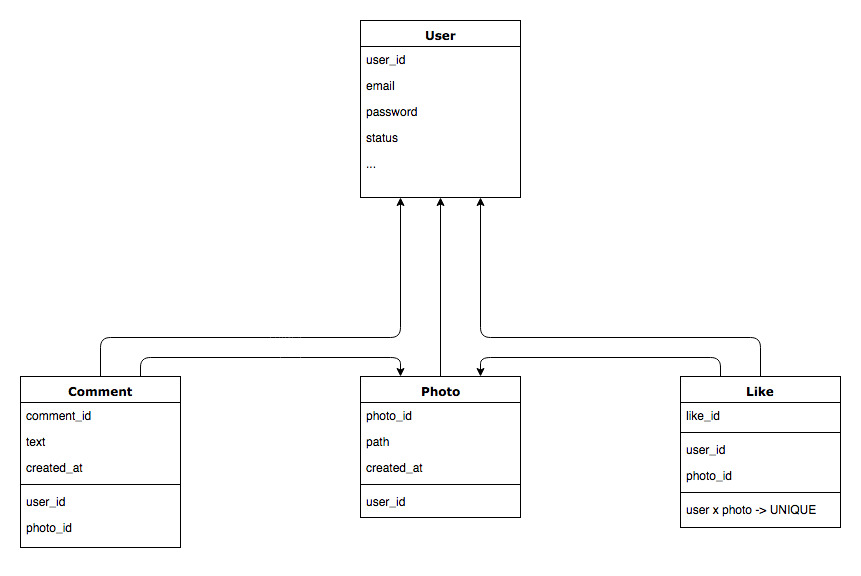

# Camagru

## Database schema


## Views
- sign in and sign up page
- montage page : taking a photo and seeing your last photos
- galery with all users photos
- photo page : seeing the photo, the comments and the likes
- user account : editing your email, password...

## Routes

### Users
```
GET     /users/:id          #show
GET     /users/new          #new
GET     /users/:id/edit     #edit
POST    /users              #create
PATCH   /users/:id          #update
DELETE  /users/:id          #destroy
```

### Photos
```
GET     /photos             #index
GET     /photos/:id         #show
GET     /photos/new         #new
POST    /photos             #create
DELETE  /photos/:id         #destroy
```

### Comments
```
GET     /photos/:id/comments              #index
GET     /photos/:id/comments/:id/edit     #edit
POST    /photos/:id/comments              #create
PATCH   /photos/:id/comments/:id          #update
DELETE  /photos/:id/comments/:id          #destroy
```

### Likes
```
POST    /photos/:id/likes                 #create
DELETE  /photos/:id/likes/:id             #destroy
```
